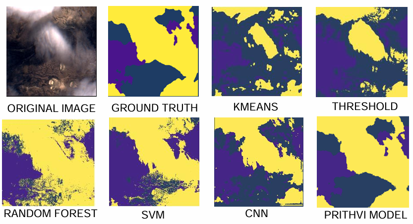
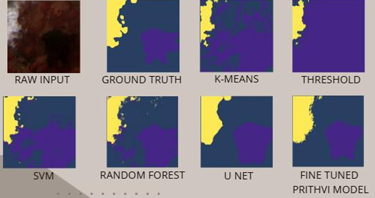

# Cloud & Shadow Segmentation using Foundation Models

<p align="center">
  
  
  
  
  
</p>

---

> Foundation model-based approach for robust cloud and shadow segmentation across sensors (CloudSen12 → LISS-4).

---

## Overview

This project focuses on **multi-class segmentation of clouds and cloud shadows** from satellite imagery using:

- Classical methods  
- Machine learning models  
- Deep learning (CNN)  
- Foundation models (Prithvi ViT)  

The key objective is to achieve **robust generalization across sensors**, particularly:

- Training on **CloudSen12**
- Evaluating on **LISS-4 (domain shift scenario)**

---

## Why This Matters

Clouds and shadows severely impact downstream remote sensing tasks:

- Land cover mapping  
- Change detection  
- Environmental monitoring  

Poor segmentation leads to:
- Incorrect analysis  
- Data corruption  

This project addresses this by leveraging **foundation models for better generalization**.

---

## Approach

We evaluate multiple approaches:

### Classical Methods
- Thresholding  
- K-Means  

### Machine Learning
- Random Forest  
- Support Vector Machine  

### Deep Learning
- CNN baseline  

### Foundation Model
- Prithvi Vision Transformer  

---

## Qualitative Results

### CloudSen12



### LISS-4



---

## Label Legend

- 🟨 **Cloud**  
- 🟪 **Cloud Shadow**  
- 🟦 **Background**

> Colors are consistent across all qualitative results for easy comparison.

---

## Quantitative Results

Results are reported separately for:

- **CloudSen12** → in-domain performance  
- **LISS-4** → cross-sensor generalization  

### CloudSen12

| Model           | Accuracy | mIoU  | F1 Score |
|----------------|----------|-------|----------|
| Threshold      | 0.3080   | 0.2238 | 0.3233 |
| K-Means        | 0.5217   | 0.3472 | 0.5151 |
| Random Forest  | 0.8137   | 0.6634 | 0.7917 |
| SVM            | 0.7279   | 0.5725 | 0.7148 |
| CNN            | 0.8708   | 0.7626 | 0.8650 |
| **Prithvi**     | **0.8859** | **0.7857** | **0.8798** |

---

### LISS-4 (Cross-Sensor Evaluation)

| Model           | Accuracy | mIoU  | F1 Score |
|----------------|----------|-------|----------|
| Threshold      | 0.2894   | 0.2051 | 0.3012 |
| K-Means        | 0.4987   | 0.3324 | 0.4921 |
| Random Forest  | 0.7842   | 0.6418 | 0.7695 |
| SVM            | 0.7013   | 0.5537 | 0.6891 |
| CNN            | 0.8186   | 0.6668 | 0.7965 |
| **Prithvi**     | **0.9913** | **0.7476** | **0.8447** |

> Performance drop across classical and CNN models highlights the impact of domain shift, while the foundation model maintains strong generalization.

---

## Key Insights

- Classical methods fail due to spectral ambiguity  
- ML models improve but lack spatial understanding  
- CNN captures local features but struggles with generalization  
- Foundation models capture **global context and transfer better across domains**  

---

## Experiment Setup

- Patch size: 224 × 224  
- Stride: 112  
- Classes: 3 (Cloud, Shadow, Background)  
- Loss: Hybrid (Focal + Dice)  
- Input: Multispectral satellite imagery  

---

## Project Structure

```
src/            Core pipeline  
experiments/    Baselines (classical + CNN)  
configs/        Experiment configs  
results/        Qualitative + quantitative outputs  
requirements.txt  
README.md  
```

---

## Setup

```bash
pip install -r requirements.txt
```

---

## Run

### Training
```bash
python src/training/train.py
```

### Inference
```bash
python src/inference/infer.py \
  --input data/sample.tif \
  --checkpoint checkpoints/model.pth \
  --output results/pred.png
```

### Benchmark
```bash
python src/evaluation/benchmark.py
```

---

## Key Contributions

- Multi-class segmentation (cloud + shadow)  
- Cross-sensor domain adaptation  
- Foundation model integration for remote sensing  
- End-to-end reproducible pipeline  

---
